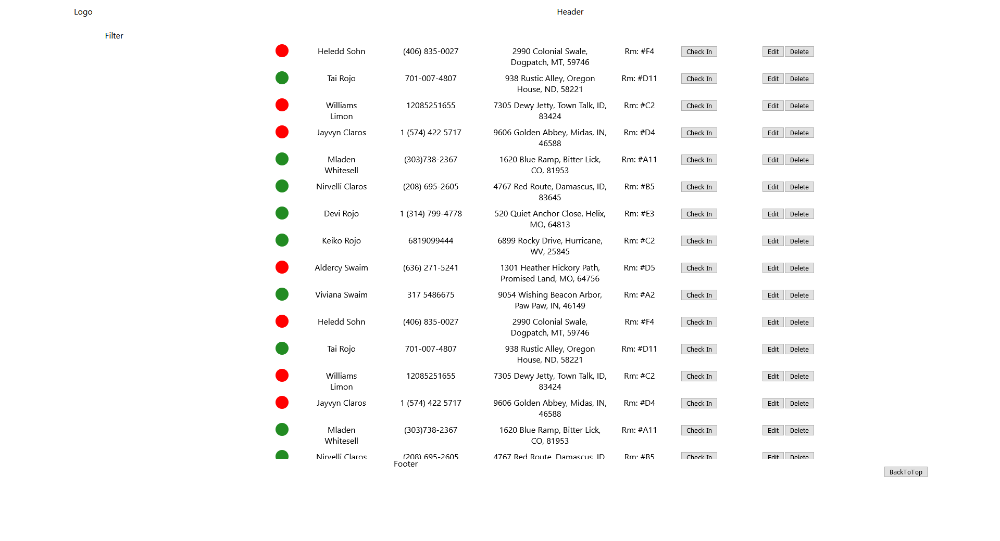

## Guest Book powered by Next.js/MongoDB Atlas



To run this in a development server clone this project then copy, paste and run this command in your terminal.

```bash
npm run dev && start firefox localhost:3000
# or
yarn dev && start firefox localhost:3000
```

#### Guest Book
This application is a guest book of randomly generated guests which stay in a fictional hotel. Guests can have any information edited, be checked in or checked out or outright deleted. Information for each guest is stored in the MongoDB Atlas where client-side fetching populates and paginates the Guest Book Display making the entire app serverless! Next.js the main framework used for constructing components.

*Although there is Bootstrap like syntax all styles are custom made using Scss*

Poke around and add any fun changes to make this demo app suit your needs!